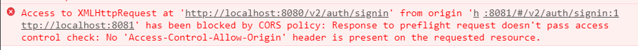
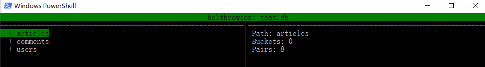
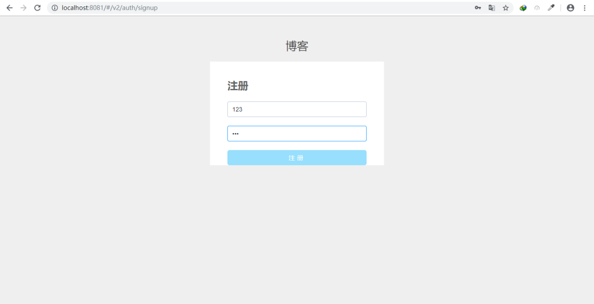
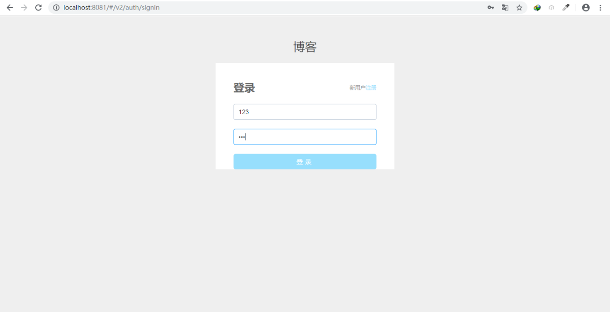
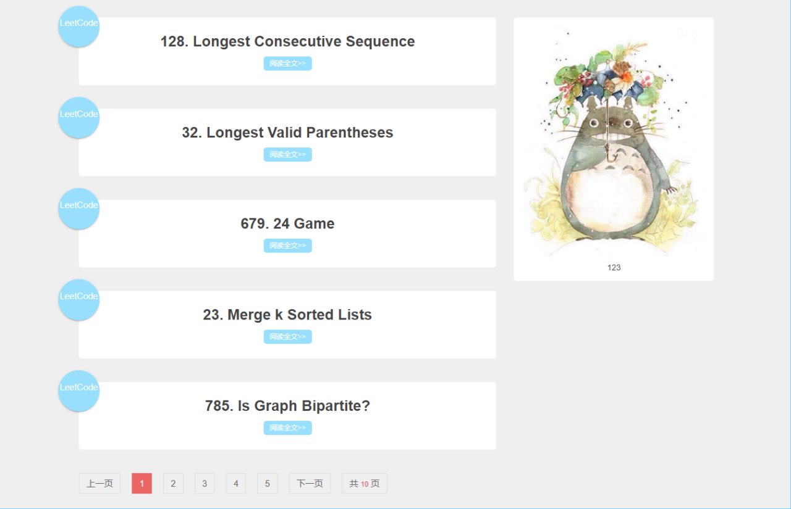
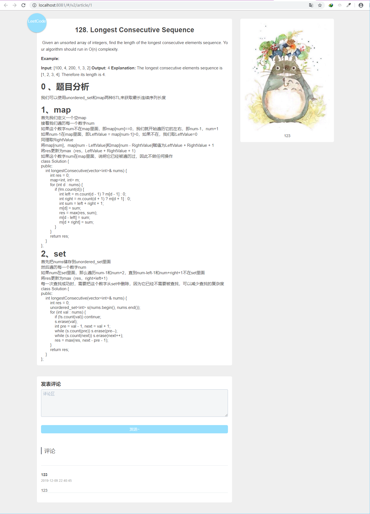

# 服务计算：简单web服务与客户端开发实战——API设计与前后端耦合

作业要求:

[简单 web 服务与客户端开发实战](<https://pmlpml.github.io/ServiceComputingOnCloud/ex-services>)

项目地址:

[github团队](<https://github.com/Happy726ZZZ>)

## API设计

api设计参考[SimpleBlog](<https://gostbops.github.io/API-doc/>),设计了四种资源,User,Article,Comment,Tag.

分别对应用户,文章,评论,标签.

API服务对应如下:

- User:
- - SignIn

- - SignUp

- Article:

- - GetArticles

- - GetArticleById

- Comment:

- - GetCommentsOfArticle

- - CreateComment

使用swagger编写,[在线编辑器](<http://editor.swagger.io/>)

可以用yaml和json进行编写,官方推荐yaml

在开头定义跟路径(/v2)

```yaml
swagger: "2.0"
info:
  description: "A Simple Blog"
  version: "1.0.0"
  title: "Swagger Blog"
host: "blog.swagger.io"
basePath: "/v2"
tags:
- name: "Article"
- name: "User"
schemes:
- "https"
- "http"
```

具体设计主要是在paths标签下定义请求路径(/url),请求方式(get/post),请求参数(parameters)和返回样例(responses)

部分项目api设计如下:

```yaml
paths:
  /articles:
    get:
      tags:
      - "Article"
      summary: "Get articles"
      description: ""
      operationId: "GetArticles"
      produces:
      - "application/json"
      parameters:
      - name: "page"
        in: "query"
        description: "the request page"
        required: true
        type: "string"
      responses:
        200:
          description: OK
          schema:
            $ref: "#/definitions/ArticlesResponse"
        404:
          description: "Not Found"
          schema:
            type: object
            properties:
              error: 
                type: string
                example:
                - "User Not Exists"
                - "Article Not Exists"
  /article/{id}:
    get:
      tags:
      - "Article"
      summary: "Get article by id"
      description: ""
      operationId: "GetArticleById"
      produces:
      - "application/json"
      parameters:
      - name: "id"
        in: "path"
        description: "The unique Id of the article"
        required: true
        type: "integer"
        x-exportParamName: "Id"
      responses:
        200:
          description: OK
          schema:
            $ref: "#/definitions/Article"
        400:
          description: "Bad Request"
          schema:
            type: object
            properties:
              error: 
                type: string
                example:
                - "Wrong ArticleId"
        404:
          description: "Not Found"
          schema:
            type: object
            properties:
              error: 
                type: string
                example:
                - "Article Not Exists"
```

在完成api设计后,可以利用swagger生成go服务端,然后前后端可以独立开发.

前端选择vue框架开发,后端选择go语言开发

其中前端可以使用mock模拟数据,拦截客户端发出的http请求并返回mock.js中自定义生成的随机数据;

后端可以使用postman模拟客户端发送的http请求.

## 前后端耦合

前后端独立完成开发之后开始进行耦合.

首先问题是vue客户端和服务端都运行在localhost:8080端口,就会导致端口被占用.所以在vue客户端的配置中将config/index.js中dev环境的端口号port改为8081

在发送post请求中遇到了Access-Control的问题



就是浏览器的跨域请求,由于端口不同,客户端在8081,服务端在8080,如果客户端要post

可以参考[跨域请求](<https://www.jianshu.com/p/89a377c52b48>)

一开始的解决方法是在go服务端的routes.go中增加OPTIONS的预检,客户端在post前会先发送一个options的请求,收到204的返回后再发送post请求.

```go
var routes = Routes{
    ...
	Route{
		"OPTIONS",
		strings.ToUpper("options"),
		"/v2/auth/signin",
		Options,
	},

	Route{
		"OPTIONS",
		strings.ToUpper("options"),
		"/v2/article/{id}/comment",
		Options,
	},

	Route{
		"OPTIONS",
		strings.ToUpper("options"),
		"/v2/auth/signup",
		Options,
	},
}

func Options(w http.ResponseWriter, r *http.Request) {
	w.Header().Set("Access-Control-Allow-Methods", "PUT,POST,GET,DELETE,OPTIONS")
	w.Header().Set("Access-Control-Allow-Headers", "X-Requested-With,Content-Type,Authorization")
	w.Header().Set("Access-Control-Allow-Origin", "*")
	w.Header().Set("Content-Type", "application/json")
	w.WriteHeader(204)
}
```

boltdbs生成的.db文件可以通过boltbrowser查看

使用`go get github.com/br0xen/browser`安装

然后在.db文件存放目录打开终端或shell使用

`boltbrowser -f test.db`就可以查看了



在之后又遇到了发送完options请求后不再发送get请求,所以改用另外一个方案,纯前端解决跨域问题.

使用axios直接进行跨域访问不可行，我们就需要配置代理了。代理可以解决的原因：因为客户端请求服务端的数据是存在跨域问题的，而服务器和服务器之间可以相互请求数据，是没有跨域的概念（如果服务器没有设置禁止跨域的权限问题），也就是说，我们可以配置一个代理的服务器可以请求另一个服务器中的数据，然后把请求出来的数据返回到我们的代理服务器中，代理服务器再返回数据给我们的客户端，这样我们就可以实现跨域访问数据。

具体步骤如下:

- 在main.js中配置BaseUrl

- 在config/index.js中配置proxyTable代理,设置changeOrigin为true
- 在具体发送http请求时修改url即可

后来发现是因为cookie的原因后端判断origin的时候出现问题.

## 运行效果截图

### 注册登录页面





### 博客列表页面



### 博客详情页面

